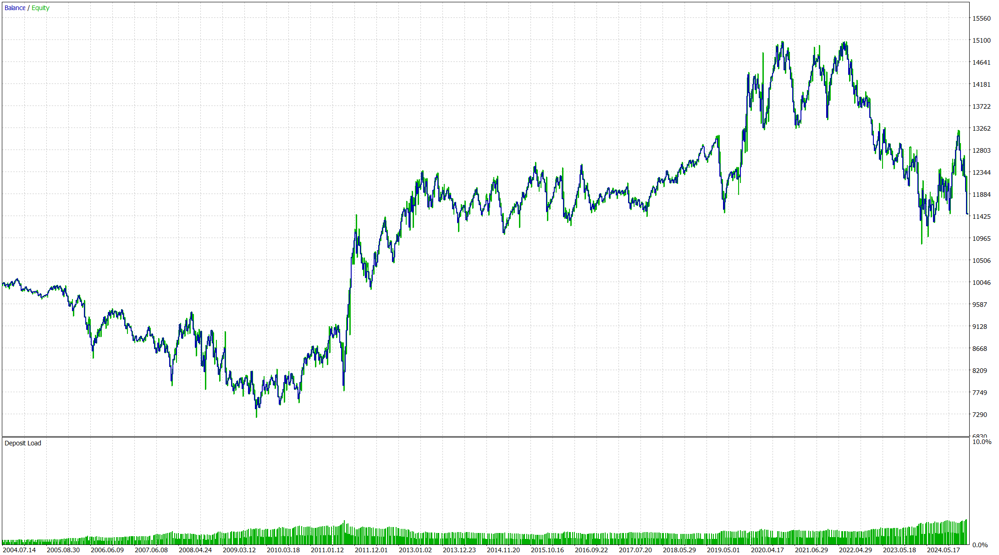

# FRSI_Gold

**FRSI_Gold** là một bot giao dịch tự động được thiết kế để giao dịch vàng (XAU/USD) trên khung thời gian 4 giờ, sử dụng chỉ báo RSI (Relative Strength Index) làm cơ sở xác định điểm vào lệnh. Bot hoạt động theo chiến lược đơn giản nhưng hiệu quả:  
- **Mua**: Khi giá thoát khỏi vùng quá bán (RSI dưới 30 và tăng qua 40).  
- **Bán**: Khi giá rời vùng quá mua (RSI trên 70 và giảm qua 60).  

## Tính năng chính
- **Quản lý lệnh**: Bot mở hai lệnh giao dịch đồng thời với kích thước lô tùy chỉnh (mặc định 0.05 lot), kèm theo mức chốt lời (Take Profit) và dừng lỗ (Stop Loss) được tính toán dựa trên giá cực đại (peak) hoặc cực tiểu (bottom) gần nhất, Take Profit 1 và Stop Loss theo tỷ lệ 1:1, Take Profit 2 thả tự do cho đến khi RSI chạm vùng quá mua hoặc quá bán.
- **Điều chỉnh Stop Loss**: Tự động di chuyển Stop Loss về điểm vào lệnh khi giá chạm Take Profit 1, giúp bảo toàn vốn.  
- **Trực quan hóa tín hiệu**: Các điểm vào lệnh được đánh dấu bằng mũi tên trên biểu đồ (mũi tên xanh cho lệnh mua, đỏ cho lệnh bán), hỗ trợ theo dõi dễ dàng.

## Mục đích sử dụng
FRSI_Gold là công cụ tự động hóa giao dịch vàng theo xu hướng RSI trên khung thời gian H4.

## Yêu cầu
- Cặp tiền: XAU/USD (vàng).  
- Khung thời gian: H4 (4 giờ).  

## Lưu ý
- Kiểm tra kỹ trên tài khoản demo trước khi sử dụng trên tài khoản thực.
- Tùy chỉnh kích thước lô (`lotSize`) theo khả năng quản lý vốn của bạn.

## Thử nghiệm
Kết quả thử nghiệm bot trên cặp XAU/USD (vàng) tại khung thời gian H4 với **entire history**.

